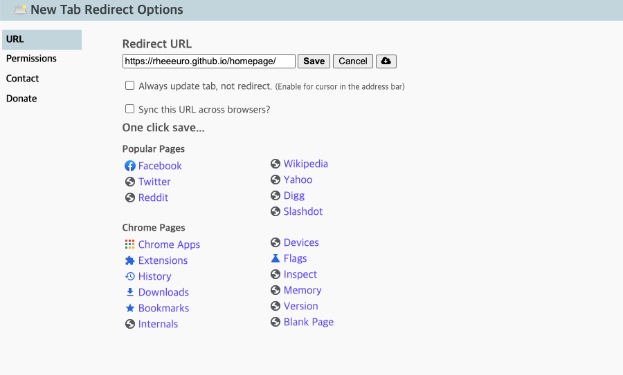
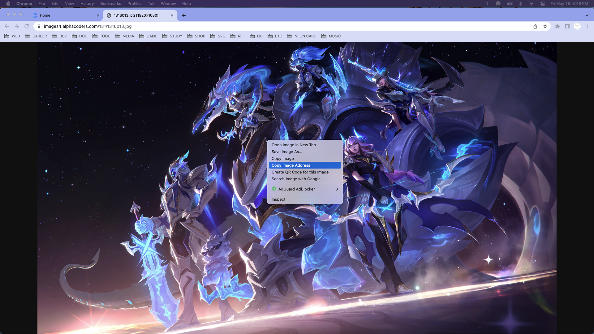
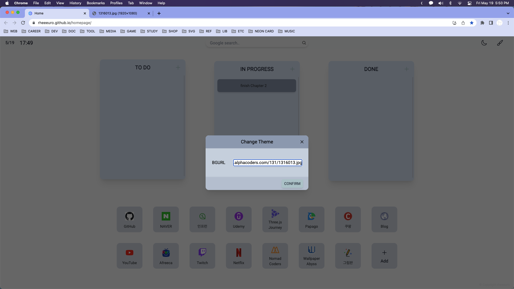

# New-Tab-Page

## Stack

## How To Use

### 1. Install Chrome Extension - [New Tab Redirect](https://chrome.google.com/webstore/detail/new-tab-redirect/icpgjfneehieebagbmdbhnlpiopdcmna)

### 2. Set Redirect URL - https://rheeeuro.github.io/homepage/

## Change Background Image

### 1. Copy Any Image Address

### 2. Click Paint Button and paste address at BGURL input

### 3. Check your background image changed

